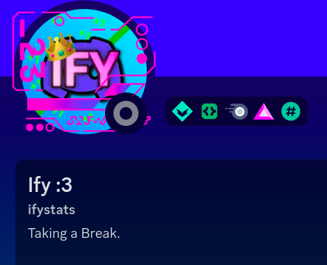

Just yesterday as I write this, on March 21st, my friend (or, well, ex-friend) **Matheusify**, who we'll refer to as **Matheus** from now on, blackmailed and threatened me just because I didn't want to tell him a secret of mine.

This blog post delves into the deep delusion that Matheus has gone through. From the initial incident, to the reaction, to the apology, we've got it all.

## UPDATE (03/23/2024)

Just a few hours after this blog post's release, Matheus decided to "take a break from Discord."

He also took a break from YouTube. But not before he commented on my community post about this blog post saying that it's "all lies" and it's just "fake bs that [I] made to ruin [his] image."

I thought [you were sorry for doing all of this](#chapter-6-he-gives-up), but now you're saying I'm lying? Also I thought you said this was a character that you played? Oh well, I guess all of that gets thrown out the window once you actually get exposed in the spotlight.

To be fair, I saw this coming. [He did say he would do this](#its-all-lies), so I'm not surprised.

## UPDATE (03/24/2024)

The same day that I made [that last update](#update-03232024), he came back on Discord. That was a short break.

When he came back, he decided to take things up a notch. He brought back the [infamous red profile and angry character](#red-profile) from the initial incident.

He then started posting screenshots of something private with him and [TERA](https://youtube.com/@TERA_TV) (which I won't include here for his own privacy) and started using that as blackmail.

![Matheus saying "did you really think I wouldn't [screenshot] that to use as blackmail"](./images/update-2-blackmail.png)

He also told me to kill myself in his about me.

There was so much more, but I can't include it all in this update, otherwise just this update alone would be a 10 minute read. Though I'm considering making this a separate blog post, as this whole situation is its own can of worms.

Though, he did [actually apologize on his community tab on his YouTube channel](https://www.youtube.com/post/UgkxWKCH9PzwZElvSxi9sj4XPHYiiIRuuVc-). That's something!

Though, I still do not accept this apology. Unless I see actual change in Matheus, I'm not going to accept him as my friend.

## Credits

Before we get into this, I'd like to thank [Galvin/Stats100](https://youtube.com/@Stats100), [Charlie from the MrBeast Stats crew](https://twitter.com/charlieashfordd), [GNZGUY](https://youtube.com/@GNZGUY), and [Dario](https://youtube.com/@DarioCounts) for helping me get all of the evidence for this. It's pretty hard to get evidence from a group chat you were kicked out of just because you didn't want to tell someone a secret.

## Chapter 1: The Backstory

Just before the incident, I had a huge mental and physical breakdown. Yes I was physically crying (this will be important later). This was because I did something that I currently do not want to disclose due to privacy reasons. [Choccy](https://youtube.com/@ChoccyStatistics) and Galvin were trying to comfort me, and I was feeling better. I even told Galvin what had happened because I trust him to keep it between the two of us (don't ask him to tell you though). Everything seemed to be going well.

Until Matheus entered the chat.

## Chapter 2: It Begins

Matheus immediately joins the chat by asking me to tell him the secret too.

![Matheus asking me to "tell [him] also in DMs you YAB"](./images/tell-me-also-in-dms-you-yab.png)

I told him I didn't want to tell him because it was something I didn't want anyone to know, and Matheus has had a track record of leaking my secrets.

This seems tame so far, but it only gets worse.

### Chapter 2.2: The Blackmail Starts

After I didn't respond for a few minutes, he decided to hit me and the rest of the group members with a bombshell:

This is where the blackmail and threats begin. He starts tame by saying that he'll stop hating on [YAB ?! Counts](https://yabcounts.com) if I tell him. I told him to "please stop," because I was literally crying on my table reading these messages.

Does he stop? Of course not, he doubles down!

At this point, I'm just screaming and begging him to stop, but he triples down and says that he doesn't care.

And by this point, Galvin was already telling him to stop, because this was getting way too out of hand. But he quadrouples down, saying that he's "a narcissist after all" and that he "cares more about [himself] than [the] well being of others".

And then he quintuples down (that's a word I haven't heard of until writing this) by agreeing to what I said about him blackmailing me over the biggest secret of my life.

And then Matheus tells me that he could "end my 2 streams if [he] feels like it," which to me sounds like a threat.

That's where I drew the line, and I blocked him and removed his access from Graphify, to which he quickly responded by kicking me from his group chat.

If this is where it ended, I wouldn't have made a blog post. But oh boy it gets worse.

## Chapter 3: Thinking He's In The Right?

Yep, the rollercoaster has just begun. After I had left him behind, he started talking in another group chat about the situation, and he said that he won't apologize for what he did.

Later on in the conversation, he changes everything about his profile to just question marks.

And then he doubles down on this, changing his profile to all red and setting his status to "Not apologizing as I believe I am not in the wrong."

His about me also says "Things are not how they seem" in morse code.

He literally blackmailed and threatened me for a secret and now he's saying he's not in the wrong and that "things are not how they seem"? The delusion is insane!

## Chapter 4: The Confrontation

After all of this, Charlie decided to DM Matheus confronting him about what he did. The first thing Charlie asked was "Why did you blackmail? That is not okay in the slightest.", and Matheus responded with "For me it is."

Excuse me?? How can you be so delusional that you think blackmailing and threatening someone is okay??

He then doubles down, saying that he "can blackmail [his] own best friend so idgaf about blackmailing people."

Afterwards, Charlie asks him why he thinks blackmail is okay, and he reiterates the point that he's a narcissist (as if that makes it okay somehow?).

![Matheus saying that he's a narcissist so "most things [he] does [he] does to benefit [himself]"](./images/im-a-narcissist-2.png)

Charlie continues, saying that he knew I was crying and he continued, and asks what part of that is normal to do. Matheus responds with "everything?", as if everything he did was just something everyone else does.

After this riviting response, Charlie told him that his reputation was on the line. He responds by saying that it "did nothing to his reputation." Charlie then responds by showing him a screenshot of one of his messages about him removing everyone from his group chat and that he doesn't want to tell anyone what happened because it will "ruin his image." He then responds by saying that he can just say that he "didn't do that" and that "it is all lies."

Charlie then tells him that I wanted to keep what happened private (which is true), and asking him why he blackmailed and bullied me for it, and asking for the reason if any. He responds by saying that he was simply "curious af" and that he "[won't] stop at any point," along with asking Charlie "since when [was him not] hating on YAB ?! Counts blackmail."

Afterwards, he then promptly blocks Charlie. That's the end of the confrontation. But we're only getting started!

## Chapter 5: Holding Graphify Hostage

After the confrontation, Matheus starts a new plan. This plan involves my main YouTube channel and project, [Graphify](https://youtube.com/@GraphifyStatistics). But first, let me give you a little bit of context.

On the same day this happened, Graphify's second channel Graphify+ was [terminated from YouTube](https://twitter.com/GraphifyStudios/status/1770782181180182946). This caused me to lose access to the main channel, Graphify, but everyone else who had permission still had access to the channel, including Matheus.

So, what did Matheus do? He decides to keep my channel hostage. Literally.

![Matheus saying that I'm "stupid if [I] think [he'll] let [me] have access to the Graphify account"](./images/toast-is-stupid-if-he-thinks-ill-let-him-have-access-to-graphify.png)

Great, now he's putting Graphify on the line all for this stupid secret! He then doubles down by demoting everyone to editor role so they couldn't remove him.

Later on, he decides out of the kindness of his own heart to give everyone their permissions back and set himself to viewer. But does he apologize? Still no. He says he's only doing it because of "pressure."

## Chapter 6: He Gives Up

After all of this chaos, he finally realizes that he was in the wrong. But of course it's Matheus, he's not gonna fully admit to his wrongdoings, he's just gonna say it was all a character he was portraying!

By the way, Matheus, if you're reading this, your apology has not been accepted. You say this everytime, when are you actually going to admit you're wrong and actually change as a person? I guess I'll have to wait another 7 decades.

## Chapter 7: Conclusion

In summary, Matheus likes to blackmail and threaten people just because he's "curious" of something, and will go to great lengths to prove that he's in the right and that he did nothing wrong.

Thank you for reading all the way through! This took a long time to make, and to witness first-hand as the victim. Again, special thanks to [Galvin/Stats100](https://youtube.com/@Stats100), [Charlie from the MrBeast Stats crew](https://twitter.com/charlieashfordd), [GNZGUY](https://youtube.com/@GNZGUY), and [Dario](https://youtube.com/@DarioCounts) for helping me get the evidence for this. And to everyone else who supported me during my mental breakdown, and who still supported me even after Matheus' delusion.

If you want to see the beginning of this whole debacle, check out my new website [matheus.toasted.dev](https://matheus.toasted.dev), which is an archive of his group chat that shows all of the messages on the day of the incident.

Also, for those curious, yes I did block him again.

Not like he blocked me first, but oh well, all is well that ends well. Except this time it didn't end well.
